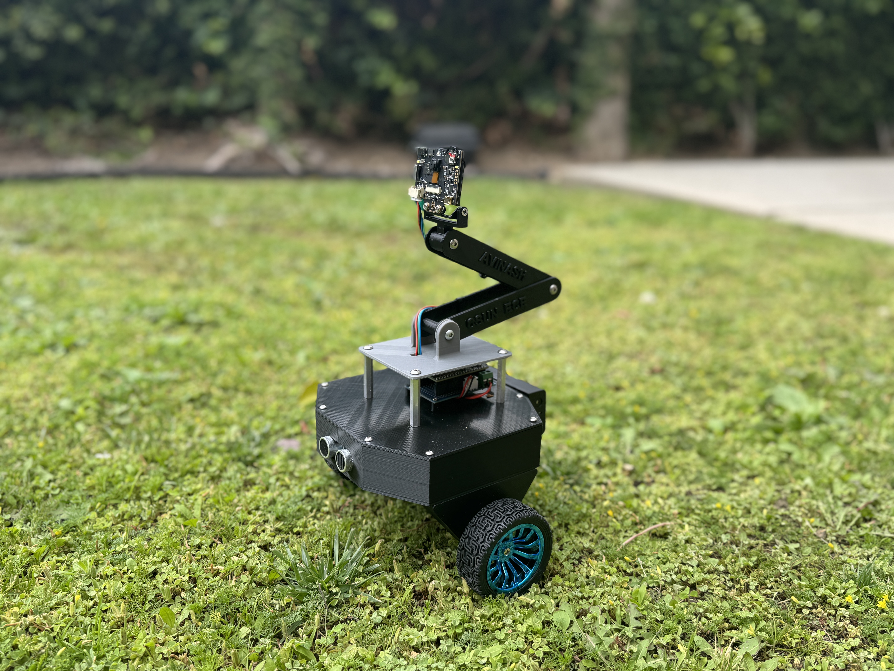

# Face-Following Robot with HuskyLens and ESP32

 

## 📝 Description
A robot that detects and follows human faces using **HuskyLens** (AI camera) and **ESP32**. It uses PID control for smooth movements.

## 🛠 Hardware Components
- ESP32 Microcontroller
- HuskyLens AI Camera
- L298N Motor Driver
- 2x DC Motors
- Chassis + Wheels
- Power Supply (Battery)

## 🔌 Wiring Diagram
| HuskyLens | ESP32 |
|-----------|-------|
| SDA       | GPIO21|
| SCL       | GPIO22|
| VCC       | 5V    |
| GND       | GND   |

*(Add more wiring details if needed)*

## 💻 Software
- Arduino IDE
- Libraries:
  - `HUSKYLENS.h`
  - `HardwareSerial.h`

## 🚀 How to Use
1. Upload the code to ESP32.
2. Power the robot.
3. Train HuskyLens to recognize faces (press "Learn" button).
4. The robot will follow the trained face!

## 📊 PID Tuning
Adjust these values in the code for smoother movement:
```cpp
float Kp_fb = 1.5;  // Proportional gain (forward/backward)
float Kp_lr = 1.0;  // Proportional gain (left/right)
